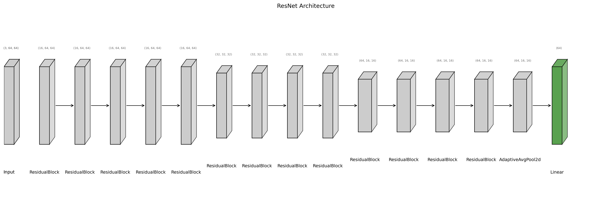

Here is the same improved README with a **formal citation section added at the end**:

---

# ResNet Implementation (He et al.)

This repository contains a faithful reproduction of the **ResNet architecture** from the paper *Deep Residual Learning for Image Recognition*. The key idea behind ResNets is the **skip connection**, which helps alleviate the degradation problem by allowing gradients to flow more easily through deep networks.

## Overview

This project implements the **CIFAR-10 variant** of ResNet described in the paper. The model begins with an initial convolution layer followed by **three stacks of residual blocks**, each containing *n* two-layer residual units with fixed channel sizes.

The architecture used for training is:



Each residual block consists of **two 3×3 convolution layers**, following the original design.

## Dataset

Training was performed on the **CIFAR-10** dataset, which contains 60k color images of size 32×32 (50k for training and 10k for testing).

## Training

The model was trained on a **Google Colab T4 GPU** using:

* **Loss:** CrossEntropyLoss
* **Optimizer:** Adam
* **Epochs:** 30
* **LR Scheduler:** Reduce-on-plateau (halves LR on stagnation)

The best performance was reached around epoch 24, after which validation accuracy plateaued.

## Results

The model achieves **84.42% test accuracy**.
This is lower than the ~92% reported in the paper, likely due to fewer training epochs and lack of data augmentation.

## Usage

```bash
python train.py models/resnet.py
```

By default, the model trains with `n = 5`, which corresponds to **ResNet-32**.
Modify `n` inside `models/resnet.py` to change the depth.

## My Observations

The Resnet architecture has trained easily than other smaller models such as Alexnet and VGG. This shows that using batchnorm at everystep and residual connections in networks enable faster training, the model also gives 100% accuracy on train set, which is surprising that neither VGG or Alexnet gave, This might be due to the fact that resnet-32 is a much deeper network, but the number of parameters are less due to only a single layer of Linear Layer. Majority of data is stored in Linear Layers, and Convolayers usually act as feature extractors, but here it is only used as a clasifier. 


## Citations
He et al, (2015). **Deep Residual Learning for Image Recognition** [Paper](https://arxiv.org/abs/1512.03385)
